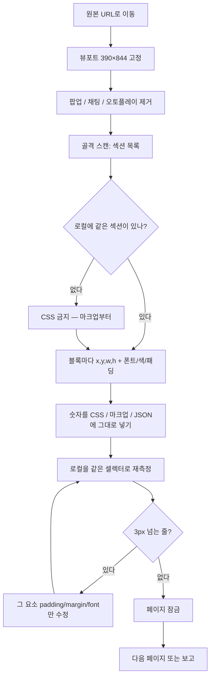
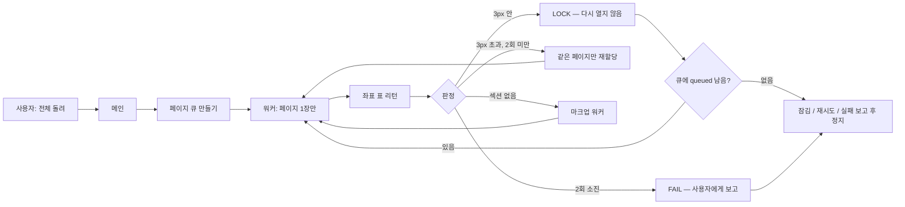
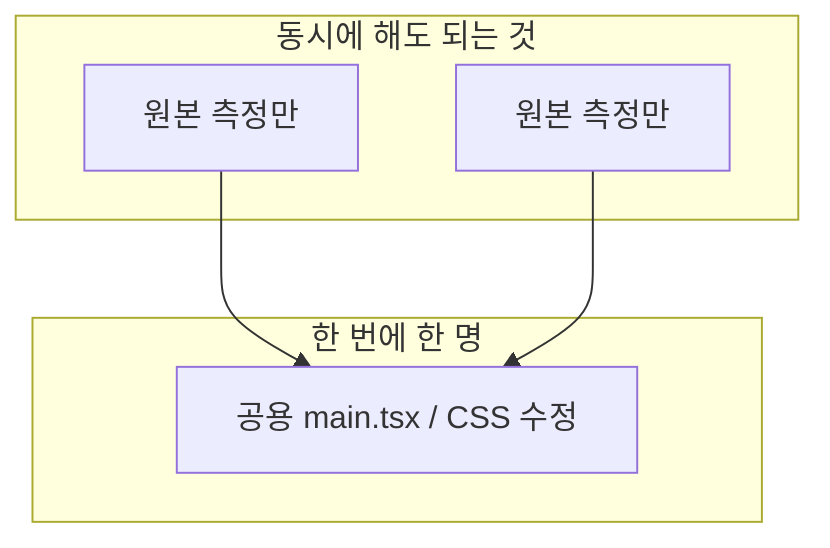

# pixel-clone

원본 웹사이트를 **스크린샷 감이 아니라 DOM을 자로 재서** 로컬 앱에 옮기는 Cursor Agent Skill.

에이전트에게 「원본이랑 똑같이」라고 하면, 이 순서만 강제한다.

```
원본 390px 고정 → 팝업 끄기 → 좌표·폰트·색 추출
→ 그 숫자를 CSS/마크업에 넣기 → 로컬에서 같은 자로 다시 재기
→ 틀린 숫자만 고치기
```

근거는 숫자다. 스크린샷은 확인용이다.

---

## 설치

Windows:

```bat
git clone https://github.com/pioneer3339/pixel-clone.git "%USERPROFILE%\.cursor\skills\pixel-clone"
```

macOS / Linux:

```bash
git clone https://github.com/pioneer3339/pixel-clone.git ~/.cursor/skills/pixel-clone
```

Cursor를 다시 연다. 이미 받아 둔 뒤 업데이트만 할 때:

```bat
cd "%USERPROFILE%\.cursor\skills\pixel-clone" && git pull
```

---

## 어떻게 쓰나

### 1. 한 번만 정할 것

에이전트에게 먼저 이 세 가지를 말한다. 안 정하면 좌표가 전부 가짜다.

| 항목 | 예 |
|---|---|
| 원본 URL | `https://example.com` |
| 로컬 주소 | `http://127.0.0.1:4627` (프로젝트마다 포트 분리) |
| 뷰포트 | 기본 `390 × 844`, mobile, 배율 1 |

페이지가 여러 장이면 원본 경로 ↔ 로컬 경로 표도 같이 준다.  
예: `/login` ↔ `#/login`

### 2. 채팅에 이렇게 말하면 된다

| 하고 싶은 일 | 이렇게 말하기 |
|---|---|
| 페이지 한 장 | `이 스킬로 로그인 페이지 원본이랑 맞춰` |
| 사이트 여러 장 | `pixel-clone 팀모드로 페이지 목록 돌려. 잠긴 건 건드리지 마` |
| 이어서 | `남은 fail이랑 queued만 한 바퀴 더` |
| 하지 말 것 | `스크린샷 보고 CSS 감으로 맞춰` ← 스킬이 금지함 |

한 장만 손볼 때는 페이지 이름과 URL만 있으면 된다.  
여러 장을 돌릴 때는 메인이 큐를 만들고, 워커는 **한 페이지씩**만 잰다.

### 3. 통과 기준

에이전트가 「완료」라고 해도 믿지 않는다. 아래 표가 나와야 한다.

```
요소        원본 [x,y,w,h]       로컬 [x,y,w,h]      판정
btn-login   [20, 120, 350, 46]   [20, 120, 350, 46]  OK
```

주요 블록이 **3px 안**이면 그 페이지를 잠근다. 다시 짜지 않는다.  
높이만 같고 내부가 비면 통과가 아니다.

---

## 워크플로우

### 페이지 한 장



스크린샷을 옆에 두고 「헤더가 조금 크다」고 때리는 경로는 없다.

### 여러 장 — 팀 루프

메인이 큐를 들고, 워커는 표만 돌려준다. 「사이트 전체를 원샷으로 끝냈다」고 말하지 않는다. 한 바퀴 돌면 멈추고 보고한다.





공용 파일을 여러 워커가 같이 고치면 다른 페이지가 사라진다. 측정은 병렬, 반영은 직렬이 기본이다.

---

## 이런 사이트에 맞다 / 아니다

| 맞다 | 아니다 |
|---|---|
| 화면이 거의 안 바뀌는 소개/문서/랜딩 | 매일 배너·상품·GIF가 바뀌는 커머스 |
| 모바일 한 폭만 복제 | 데스크톱까지 반응형 전체 |
| 보이는 레이아웃·글자·아이콘 | 실제 결제·로그인 API |

라이브 커머스면 좌표가 맞는 순간 잠그고 넘어간다. 사진 오차(MAE)가 높다고 모듈을 다시 짜지 않는다.  
화면이 고정된 사이트면 이 루프로 한 번에 끝내는 쪽이 맞다.

---

## 에이전트가 하면 안 되는 일

- 스크린샷만 보고 CSS 추측
- `170px`처럼 반올림
- 높이만 맞고 완료
- 끝난 페이지 좌표를 처음부터 다시 짜기
- GIF·실시간 상품 때문에 MAE가 높다고 레이아웃을 다시 짜기
- 원본 띄어쓰기/오탈자를 “고쳐” 버리기
- 큰 TSX를 파이썬으로 잘라 바꾸기 (사이 함수가 삭제됨)

---

## 파일

| 파일 | 언제 보나 |
|---|---|
| [`SKILL.md`](SKILL.md) | 에이전트가 따르는 본문. 실측 루프와 금지 사항 |
| [`team-loop.md`](team-loop.md) | 팀모드. 워커 프롬프트, LOCK/RETRY/FAIL |
| [`helpers.md`](helpers.md) | 브라우저에서 돌리는 측정 코드 |
| [`scripts/mae.py`](scripts/mae.py) | 잠근 뒤, GIF를 정지한 상태에서만 사진 비교 |

사이트별 포트·끝난 페이지 목록은 이 저장소에 없다. 그 프로젝트의 `CONTEXT.md` / `METHOD.md`에 둔다.

---

## 주의

개인 학습·내부용. 원본 이미지·폰트·상표를 이 스킬과 함께 배포하지 말 것.
결제/로그인 실연동은 범위 밖이다.
