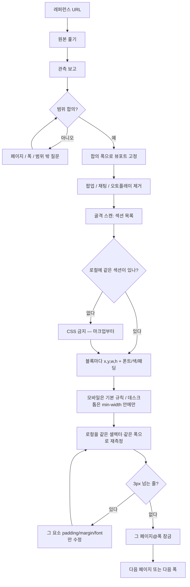
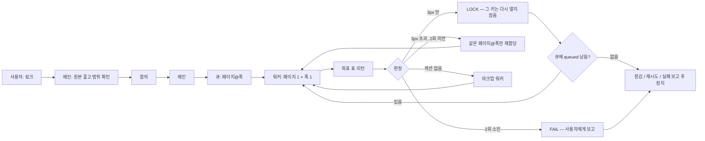
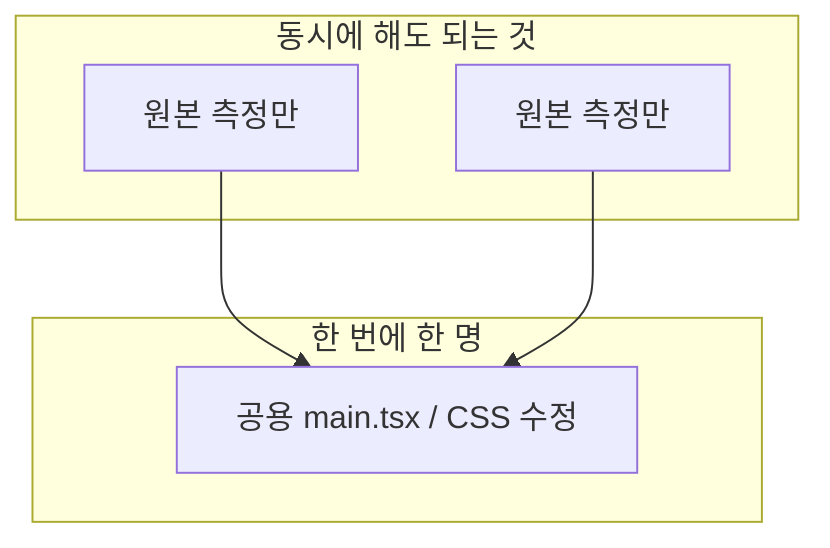

# pixel-clone

원본 웹사이트를 **스크린샷 감이 아니라 DOM을 자로 재서** 로컬 앱에 옮기는 Cursor Agent Skill.

에이전트에게 레퍼런스 링크를 주면, 이 순서만 강제한다.

```
링크 열기 → 원본 훑기 → 뭐가 필요한지 사용자에게 묻기
→ 합의한 폭만 자로 재기 → 숫자를 CSS/마크업에 넣기
→ 로컬에서 같은 자로 다시 재기 → 한 바퀴 보고 후 정지
```

한 방에 사이트를 끝내는 매크로가 아니다. 페이지×폭 루프다.
한 폭만 재면 그 폭만 맞는다. 데스크톱도 필요하면 그 폭을 따로 잰다.

근거는 숫자다. 스크린샷은 확인용이다.

---

## 설치

Windows:

```bat
git clone https://github.com/pioneer3339/pixel-clone.git "%USERPROFILE%\.cursor\skills\pixel-clone"
```

macOS / Linux:

```bash
git clone https://github.com/pioneer3339/pixel-clone.git ~/.cursor/skills/pixel-clone
```

Cursor를 다시 연다. 이미 받아 둔 뒤 업데이트만 할 때:

```bat
cd "%USERPROFILE%\.cursor\skills\pixel-clone" && git pull
```

---

## 어떻게 쓰나

### 1. 링크부터

채팅에 원본 URL을 준다. 뷰포트·페이지 목록을 미리 다 적을 필요는 없다.  
에이전트가 링크를 연 뒤, 본 것을 보고하고, **어떤 페이지 / 어느 폭 / 어디까지**를 묻는다.  
그 답이 나오기 전에 CSS를 짜지 않는 게 이 스킬이다.

이미 정해 둔 게 있으면 같이 적어도 된다.

| 있으면 바로 쓰는 것 | 예 |
|---|---|
| 원본 URL | `https://example.com` |
| 로컬 주소 | `http://127.0.0.1:4627` (프로젝트마다 포트 분리) |
| 이번 라운드 | `로그인만` / `내비에 있는 페이지만` / `데스크톱도` |

큐 키는 `페이지@폭`이다. `login@390`이 잠겨도 `login@1440`은 아직이다.

### 2. 채팅에 이렇게 말하면 된다

| 하고 싶은 일 | 이렇게 말하기 |
|---|---|
| 시작 | `이 링크 레퍼런스로 복제 루프 시작` + URL |
| 범위가 이미 있음 | `모바일만, 홈이랑 로그인만. 결제는 빼` |
| 데스크톱도 | `데스크톱도 1440으로. 모바일 잠근 규칙은 덮지 마` |
| 사이트 여러 장 | `합의한 목록 팀모드로 돌려. 잠긴 건 건드리지 마` |
| 이어서 | `남은 fail이랑 queued만 한 바퀴 더` |
| 하지 말 것 | `스크린샷 보고 CSS 감으로 맞춰` ← 스킬이 금지함 |

범위가 이미 있으면 그 페이지부터 잰다.  
여러 장을 돌릴 때는 합의 후에 메인이 큐를 만들고, 워커는 **페이지 하나 × 폭 하나**만 잰다.  
모바일과 데스크톱을 한 호출에서 섞지 않는다. 기본 순서는 모바일 먼저.

### 3. 통과 기준

에이전트가 「완료」라고 해도 믿지 않는다. 아래 표가 나와야 한다.

```
요소        원본 [x,y,w,h]       로컬 [x,y,w,h]      판정
btn-login   [20, 120, 350, 46]   [20, 120, 350, 46]  OK
```

주요 블록이 **3px 안**이면 그 **페이지@폭**을 잠근다. 다시 짜지 않는다.  
높이만 같고 내부가 비면 통과가 아니다.  
390 표와 1440 표를 겹쳐 비교하지 않는다.

---

## 워크플로우

### 페이지 한 장



스크린샷을 옆에 두고 「헤더가 조금 크다」고 때리는 경로는 없다.

### 여러 장 — 팀 루프

메인이 큐를 들고, 워커는 표만 돌려준다. 「사이트 전체를 원샷으로 끝냈다」고 말하지 않는다. 한 바퀴 돌면 멈추고 보고한다.





공용 파일을 여러 워커가 같이 고치면 다른 페이지가 사라진다. 측정은 병렬, 반영은 직렬이 기본이다.

---

## 이런 사이트에 맞다 / 아니다

| 맞다 | 아니다 |
|---|---|
| 화면이 거의 안 바뀌는 소개/문서/랜딩 | 매일 배너·상품·GIF가 바뀌는 커머스 |
| 합의한 1~2개 폭 (모바일, 필요하면 데스크톱) | 768·1024·모든 중간 폭을 무한히 맞추기 |
| 보이는 레이아웃·글자·아이콘 | 실제 결제·로그인 API |

라이브 커머스면 좌표가 맞는 순간 잠그고 넘어간다. 사진 오차(MAE)가 높다고 모듈을 다시 짜지 않는다.  
화면이 고정된 사이트면 이 루프로 한 번에 끝내는 쪽이 맞다.

---

## 에이전트가 하면 안 되는 일

- 스크린샷만 보고 CSS 추측
- `170px`처럼 반올림
- 높이만 맞고 완료
- 끝난 페이지@폭 좌표를 처음부터 다시 짜기
- 모바일 숫자를 데스크톱 CSS에 넣거나, 창만 넓히고 데스크톱이라고 하기
- 모바일 레이아웃을 `scale`해서 데스크톱 만들기
- GIF·실시간 상품 때문에 MAE가 높다고 레이아웃을 다시 짜기
- 원본 띄어쓰기/오탈자를 “고쳐” 버리기
- 큰 TSX를 파이썬으로 잘라 바꾸기 (사이 함수가 삭제됨)

---

## 파일

| 파일 | 언제 보나 |
|---|---|
| [`SKILL.md`](SKILL.md) | 에이전트가 따르는 본문. 실측 루프와 금지 사항 |
| [`team-loop.md`](team-loop.md) | 팀모드. 워커 프롬프트, LOCK/RETRY/FAIL |
| [`helpers.md`](helpers.md) | 브라우저에서 돌리는 측정 코드 |
| [`scripts/mae.py`](scripts/mae.py) | 잠근 뒤, GIF를 정지한 상태에서만 사진 비교 |

사이트별 포트·끝난 페이지 목록은 이 저장소에 없다. 그 프로젝트의 `CONTEXT.md` / `METHOD.md`에 둔다.

---

## 주의

개인 학습·내부용. 원본 이미지·폰트·상표를 이 스킬과 함께 배포하지 말 것.
결제/로그인 실연동은 범위 밖이다.
